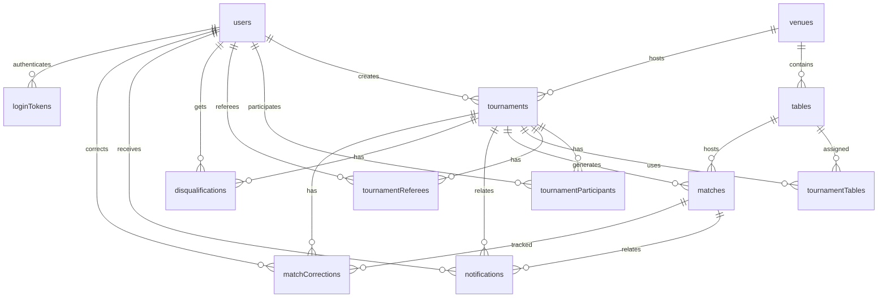

# Техническая документация Cue Bot

## Содержание

1. [Обзор системы](#обзор-системы)
2. [Архитектура проекта](#архитектура-проекта)
3. [Модель данных](#модель-данных)
4. [Схемы пользовательских путей](#схемы-пользовательских-путей)
5. [API и команды бота](#api-и-команды-бота)
6. [Бизнес-логика](#бизнес-логика)
7. [Админ-панель](#админ-панель)
8. [Особенности реализации](#особенности-реализации)

---

## Обзор системы

**Cue Bot** — система для проведения турниров по бильярду, состоящая из Telegram-бота, HTTP API и административной SPA-панели. Проект покрывает полный жизненный цикл турнира: создание черновика, выбор площадки и столов, регистрацию участников (в том числе по ссылке-приглашению), генерацию сетки, проведение матчей, фиксацию результатов и уведомления через Telegram.

### Технологический стек

- **Runtime**: Node.js + TypeScript (ESM, NodeNext)
- **Telegram Bot Framework**: grammY (webhook в production, long polling в dev)
- **HTTP API**: Hono (через `@hono/node-server`)
- **Валидация API**: Zod + `@hono/zod-validator`
- **База данных**: PostgreSQL (все таблицы живут в схеме `prod`)
- **ORM**: Drizzle ORM
- **Admin SPA**: React + Vite + TanStack Query
- **Аутентификация админки**: JWT в HttpOnly-cookie + одноразовые URL-токены входа
- **Работа с датой и временем**: Luxon
- **Dev tooling**: Nodemon, TSX, Prettier, ESLint 9 (`eslint-config-love`), Vitest

### Основные возможности

- Создание турниров через Telegram-бота (модульный wizard) и через admin-панель
- Обязательная привязка турнира к площадке (`venue`)
- Выбор столов только в рамках выбранной площадки
- Четыре формата сетки: `single_elimination`, `double_elimination`, `round_robin`, `groups_playoff`
- Режим случайных пар (`randomAdvancement`) поверх любого формата
- Публичные и приватные турниры (`visibility`), вступление по deep-link приглашению
- Регистрация и отмена регистрации участников, добавление внешних (гостевых) участников из админки
- Проведение матчей с двухфазным подтверждением результата
- Технические результаты для администраторов и судей
- Корректировка результата завершённого матча с откатом зависимых матчей
- Назначение судей на конкретные турниры
- Профиль игрока (имя/фамилия) и его редактирование, статистика, мягкое удаление (анонимизация)
- Telegram-уведомления по ключевым событиям турнира
- Административный веб-интерфейс с JWT-защитой маршрутов
- Защита от флуда (token-bucket rate limiter) на стороне бота и на чувствительных HTTP-маршрутах

---

## Архитектура проекта

Единственный Node-процесс (`src/index.ts`) запускает **одновременно** grammY-бота и Hono
HTTP-сервер на `ADMIN_PORT` (по умолчанию 3000). Бот получает обновления через **вебхук в
production** (Telegram шлёт `POST` на `/api/telegram/webhook/<TELEGRAM_WEBHOOK_SECRET>` того же
Hono-сервера; секрет проверяется и по заголовку `X-Telegram-Bot-Api-Secret-Token` через
`webhookCallback(bot, 'hono', { secretToken })`, grammY отвечает `401` при несовпадении) и через
**long polling в dev**. Режим выбирается по `NODE_ENV === 'production'` в `startBot()`; в dev перед
polling вызывается `deleteWebhook()`. В production Hono дополнительно отдаёт собранную admin SPA из
`admin/dist`. HTTP-сервер поднимается **первым**, чтобы admin API был доступен независимо от
состояния бота.

### Структура директорий

```text
cue-bot/
├── src/
│   ├── admin/
│   │   └── server/
│   │       ├── routes/                  # Hono-маршруты admin API (tournaments, matches, users, tables, venues)
│   │       ├── middleware/
│   │       │   └── rateLimit.ts         # IP-based rate limiter для чувствительных маршрутов
│   │       ├── apiTypes.ts              # реэкспорт общих API-типов сервера
│   │       ├── auth.ts                  # роутер входа: /token, /logout, /me
│   │       ├── formats.ts               # форматы турнира (single source of truth)
│   │       ├── tournamentOptions.ts     # допустимые значения maxParticipants/winScore/групп и их валидация
│   │       ├── index.ts                 # сборка Hono-приложения admin API (createAdminServer)
│   │       └── middleware.ts            # requireAdmin (JWT-проверка + re-check роли), signToken, JWT_SECRET
│   ├── bot/
│   │   ├── @types/                      # типы read-моделей для bot/UI/API
│   │   ├── handlers/                    # команды и callback-обработчики grammY (+ helpers/)
│   │   ├── middleware/                  # auth, wizardGuard, rateLimit middleware бота
│   │   ├── ui/                          # форматирование сообщений и клавиатуры
│   │   ├── wizards/
│   │   │   ├── tournamentCreation/      # wizard создания турнира (flow/renderer/keyboards/stateStore/module/const/d.ts)
│   │   │   ├── profileEdit/             # wizard редактирования профиля
│   │   │   └── wizardRegistry.ts        # реестр wizard-ов и определение активного по dialog_sessions
│   │   ├── commands.ts                  # наборы команд бота для разных ролей
│   │   ├── guards.ts                    # adminOnly / privateOnly guard-обёртки
│   │   ├── instance.ts                  # создание экземпляра бота
│   │   ├── permissions.ts               # проверка ролей и судейства
│   │   └── types.ts                     # BotContext / SessionData
│   ├── db/
│   │   ├── schema/                      # схемы таблиц Drizzle по файлам
│   │   ├── db.ts                        # ленивый пул PostgreSQL (throw при отсутствии DATABASE_URL)
│   │   ├── schema.ts                    # реэкспорт схем и типов
│   │   └── schemaHelpers.ts             # общие колонки, prodSchema, enumCheck
│   ├── lib/
│   │   └── rateLimiter.ts               # generic token-bucket RateLimiter
│   ├── services/                        # вся бизнес-логика и мутации БД
│   ├── utils/
│   │   ├── constants.ts
│   │   ├── dateTimeHelper.ts
│   │   ├── errors.ts                    # errorMessage() для безопасного извлечения текста ошибки
│   │   └── messageHelpers.ts
│   └── index.ts                         # запуск бота + HTTP-сервера, deep-link, graceful shutdown
├── admin/                               # отдельный Vite/React проект (свой package.json)
│   ├── src/
│   │   ├── components/
│   │   ├── lib/
│   │   └── pages/
│   ├── package.json
│   └── vite.config.ts
├── audit/                               # исторический отчёт аудита (snapshot)
├── scripts/                             # сиды и вспомогательные скрипты
├── TECHNICAL_DOCUMENTATION.md
├── CHANGELOG.md
├── README.md
├── drizzle.config.ts
├── eslint.config.js
├── nodemon.json
├── package.json
└── tsconfig.json
```

### Слои приложения

1. **Telegram Bot / Admin SPA**
   Бот работает через grammY, admin-панель — через React SPA.

2. **Transport Layer**
   Входящие Telegram-сообщения и callback query обрабатываются в `src/bot/handlers/*`. HTTP-запросы админки обслуживаются через Hono-маршруты в `src/admin/server/routes/*`.

3. **Middleware / Guards**
   - Бот: `rateLimitMiddleware` (флуд-защита, выполняется **первым**, до upsert пользователя) → `authMiddleware` (загружает/создаёт `ctx.dbUser`) → `wizardGuardMiddleware` (блокирует посторонние команды при активном wizard). Guard-обёртки `adminOnly` / `privateOnly` (`src/bot/guards.ts`) и проверки ролей/судейства в `permissions.ts`.
   - Admin API: `secureHeaders()` на всех ответах, CORS для Vite dev-сервера (только в dev), `requireAdmin` на защищённых роутерах (валидирует JWT-cookie и **перепроверяет роль в БД на каждом запросе**), IP-rate-limit на минтинге токена входа.

4. **Service Layer**
   Вся бизнес-логика и мутации БД сосредоточены в `src/services/*` и используются совместно ботом и admin API.

5. **Persistence Layer**
   PostgreSQL + Drizzle ORM. Все таблицы — в схеме `prod` (`prodSchema` в `schemaHelpers.ts`). Схема разбита по сущностям, идентификаторы типизированы как `UUID`.

### Запуск, периодические задачи и graceful shutdown

- HTTP-сервер поднимается раньше бота; `startBot()` ретраит инициализацию (`bot.init` + `setupCommands`) до 5 раз с паузой 5 с — при неудаче admin API продолжает работать без бота.
- Периодические задачи (оба `setInterval` с `.unref()`):
  - очистка просроченных диалоговых сессий (`sweepExpiredDialogSessions`) — раз в час;
  - прунинг неактивных бакетов rate limiter'ов (`botFloodLimiter`, `dashboardLimiter`) — раз в 5 минут.
- Graceful shutdown по `SIGTERM` / `SIGINT`: останавливаются периодические задачи → `bot.stop()` → закрытие HTTP-сервера (с дренированием) → закрытие пула БД. Watchdog на 10 с принудительно завершает процесс, если что-то зависло.

### Команды разработки и сборки

| Команда                     | Назначение                                              |
| --------------------------- | ------------------------------------------------------- |
| `npm run dev`               | бот + Hono API через `nodemon` (:3000)                  |
| `npm run dev:admin`         | Vite dev server для admin SPA (:5173, проксирует /api)  |
| `npm run dev:all`           | Postgres + бот/API + admin Vite + Drizzle Studio        |
| `npm run build`             | сборка серверной части (`tsc` + `tsc-alias` → `build/`) |
| `npm run build:admin`       | сборка admin SPA → `admin/dist/`                        |
| `npm start`                 | запуск собранного бота (`node build/index.js`)          |
| `npm run db:up` / `db:down` | запуск / остановка Docker-контейнера PostgreSQL         |
| `npm run db:generate`       | генерация миграции из изменений схемы                   |
| `npm run db:migrate`        | применение миграций                                     |
| `npm run db:studio`         | запуск Drizzle Studio                                   |
| `npm run lint` / `lint:fix` | ESLint (+ автопочинка)                                  |
| `npm run format`            | форматирование через Prettier                           |
| `npm test`                  | unit + integration (Vitest)                             |
| `npm run test:unit`         | только unit-тесты (без БД)                              |
| `npm run test:integration`  | integration-тесты (Postgres через testcontainers, docker) |

### Переменные окружения

| Переменная     | Назначение                                |
| -------------- | ----------------------------------------- |
| `BOT_TOKEN`    | токен Telegram-бота                       |
| `DATABASE_URL` | строка подключения к PostgreSQL           |
| `JWT_SECRET`   | секрет для подписи JWT админки            |
| `ADMIN_PORT`   | порт HTTP API / встроенного admin-сервера |
| `NODE_ENV`     | `development` / `production`              |

### TypeScript-конфигурация

- Два tsconfig: `tsconfig.json` — только для редактора/typecheck (`noEmit`, включает `test/`); `tsconfig.build.json` — эмитящая сборка (`rootDir: src`).
- Alias `@/* -> src/*` (резолвится `tsc-alias` при сборке и `vitest.config.ts` в тестах). NodeNext-импорты указывают `.js`-спецификаторы на `.ts`-исходники.
- Строгий TS, включая `noUncheckedIndexedAccess` и `exactOptionalPropertyTypes`.
- Admin SPA собирается отдельно и использует собственный `admin/tsconfig.json`; API read-model типы шарятся через alias `@server/*`.
- Схемы Drizzle экспортируют не только таблицы, но и прикладные типы (`ITournamentFormat`, `ITournamentWinScore`, `NotificationType` и т.д.).

---

## Модель данных

### Диаграмма базы данных



> `dialogSessions` — служебная таблица (namespace+key), не связана внешними ключами с доменными сущностями.

### Описание таблиц

#### users

Пользователи Telegram-бота и admin-панели, а также внешние (гостевые) участники, добавленные из админки.

- `id`: UUID primary key
- `telegram_id`: Telegram ID (`unique`, nullable — у гостевых записей `null`)
- `username`: отображаемый идентификатор (`not null`)
- `phone`, `email`, `name`, `surname`: опциональные поля профиля
- `role`: `user` | `admin`
- `deletedAt`: маркер мягкого удаления; `null` = активен. При установке строка превращается в tombstone — персональные данные затираются, `telegram_id` обнуляется, запись скрыта из списка админки, но FK-ссылки и история сохраняются (отображается как «Удалённый аккаунт»)
- частичный `unique`-индекс на `username` действует только для записей с непустым `telegram_id` (гостевые записи от него освобождены)

#### venues

Площадки проведения турниров.

- `id`: UUID primary key
- `name`: отображаемое название площадки
- `address`: адрес площадки
- `image`: опциональная ссылка на изображение
- `tablesCount`: вычисляемое поле read-модели API, не хранится в таблице напрямую

#### tables

Физические бильярдные столы.

- `id`: UUID primary key
- `name`: имя стола
- `venueId`: обязательная ссылка на `venues.id`
- стол не может существовать вне площадки

#### tournaments

Турниры.

- `id`: UUID primary key
- `venueId`: обязательная ссылка на площадку проведения
- `name`: название турнира (`not null`); `description`, `rules`: опциональные тексты
- `discipline`: сейчас поддерживается `snooker`
- `format`: `single_elimination` | `double_elimination` | `round_robin` | `groups_playoff`
- `randomAdvancement`: режим случайных пар (boolean, default `false`)
- `status`: `draft` → `registration_open` → `registration_closed` → `in_progress` → `completed` / `cancelled`
- `visibility`: `public` | `private` (default `public`)
- `scheduleMode`: `single_day` | `per_match` (default `single_day`)
- `startDate`: опциональная дата старта
- `confirmedParticipants`: число подтверждённых участников, фиксируется при закрытии регистрации
- `maxParticipants`: для SE/DE/RR — одно из `[8, 16, 32, 64, 128]`; для `groups_playoff` хранит производный итог (`groupsCount × participantsPerGroup`)
- `winScore`: одно из `[2, 3, 4, 5]` (default 3)
- `mergeRound`: для double elimination — после какого раунда верхней сетки нижняя сливается в single-elim плей-офф (default 2; `k` = полный double elimination без bracket reset); игнорируется для прочих форматов
- `groupsCount` / `participantsPerGroup` / `qualifiersPerGroup` / `groupDraw`: конфигурация `groups_playoff` (`null` для остальных форматов); `groupDraw` = `snake` | `random`
- `inviteCode`: 16-символьный `unique`-код для вступления по deep-link
- `createdBy`: ссылка на пользователя, создавшего турнир
- read-модель турнира дополняется полем `venueName`

#### tournamentParticipants

Связь пользователя с турниром.

- составной ключ: `tournamentId + userId`
- `status`: `pending` | `confirmed` | `cancelled`
- `seed`: позиция в сетке, назначается перед стартом турнира
- хранит историю регистрации до генерации матчей

#### tournamentReferees

Назначенные судьи турнира.

- составной ключ: `tournamentId + userId`
- используется для выдачи расширенных прав на матчи конкретного турнира

#### tournamentTables

Связь турнира со столами.

- составной ключ: `tournamentId + tableId`
- `position`: порядок столов внутри турнира
- перед записью проверяется, что все столы принадлежат выбранной площадке турнира

#### matches

Матчи турнира.

- `round` / `position`: координаты матча в сетке
- `player1Id` / `player2Id`: участники матча (nullable до заполнения сетки)
- `player1IsWalkover` / `player2IsWalkover`: признак прохода без игры (bye)
- `winnerId`: победитель матча
- `player1Score` / `player2Score`: счёт матча
- `status`: `scheduled` | `in_progress` | `pending_confirmation` | `completed` | `cancelled`
- `scheduledAt` / `startedAt` / `completedAt`: временные метки этапов матча
- `phase`: `group` | `playoff` (default `playoff`); значение `group` пишется только для группового этапа `groups_playoff`
- `groupIndex`: индекс группы для матчей группового этапа
- `bracketType`: тип сетки (строка, default `winners`; для double elimination также `losers` / `grand_final`)
- `nextMatchId` / `nextMatchPosition`: ссылка на следующий матч и слот (`player1` / `player2`)
- `losersNextMatchPosition` / `losersNextMatchSlot`: маршрут проигравшего в нижнюю сетку (double elimination)
- `tableId`: стол, на котором идёт матч (`on delete set null`)
- `reportedBy` / `confirmedBy`: участники двухфазного подтверждения результата
- `isTechnicalResult` / `technicalReason`: признак и причина технического исхода
- `isCorrected` / `correctionReason`: признак и причина ручной корректировки результата

#### matchCorrections

История ручных корректировок результатов матчей.

- `matchId`: исправленный матч
- `tournamentId`: турнир матча
- `correctedBy`: кто внёс исправление
- `reason`: причина корректировки
- `previousPlayer1Score` / `previousPlayer2Score` / `previousWinnerId`: значения до исправления
- `newPlayer1Score` / `newPlayer2Score` / `newWinnerId`: значения после исправления
- `affectedMatchIds`: массив матчей ниже по сетке, сброшенных как следствие смены победителя

#### notifications

Уведомления, сохраняемые перед отправкой через Telegram.

- `type`: `registration_confirmed`, `registration_rejected`, `bracket_formed`, `match_reminder`, `result_confirmation_request`, `result_confirmed`, `tournament_results`, `new_registration`, `participant_limit_reached`, `result_dispute`, `match_result_pending`, `disqualification`, `tournament_invitation`, `tournament_cancelled`
- `title` / `message`: заголовок и текст уведомления
- `isSent` / `sentAt`: было ли сообщение реально отправлено в Telegram и когда
- `isRead`: было ли уведомление отмечено как прочитанное
- уведомление может ссылаться на турнир и/или матч (`on delete set null`)

#### loginTokens

Одноразовые URL-токены для входа в admin-панель без ручного ввода кода.

- `token`: 32-символьный hex-токен (primary key)
- `userId`: владелец токена (`on delete cascade`)
- `expiresAt`: TTL (5 минут); токен удаляется при первом использовании

#### dialogSessions

Персистентное диалоговое / wizard-состояние бота (заменяет module-level in-memory `Map`'ы — состояние переживает рестарт процесса).

- составной ключ: `namespace + key`
- `namespace`: разделяет независимые хранилища (`tc` | `profile-edit` | `invite` | `match-schedule`)
- `key`: как правило, Telegram userId строкой
- `data`: jsonb-полезная нагрузка
- `expiresAt`: TTL, обновляется при каждой записи; чтения фильтруют просроченное, периодический sweep удаляет его из таблицы

#### disqualifications

Факты дисквалификации участников.

- `tournamentId`: турнир, в рамках которого произошла дисквалификация
- `userId`: дисквалифицированный пользователь
- `disqualifiedBy`: кто установил дисквалификацию
- `reason`: причина дисквалификации

---

## Схемы пользовательских путей

### 1. Первый запуск бота

```text
/start
  -> rateLimitMiddleware (флуд-защита)
  -> authMiddleware
    -> поиск пользователя по telegram_id
    -> создание пользователя с ролью user, если записи нет
    -> обновление username
    -> добавление ctx.dbUser в контекст
  -> установка набора команд по роли (admin / referee / user)
  -> приветствие + главное меню
  -> если payload = join_<code> — вступление в турнир по приглашению
```

### 2. Создание турнира в Telegram-боте

Команда `/create_tournament` запускает модульный wizard из `src/bot/wizards/tournamentCreation/`.

Шаги мастера (последовательность зависит от выбранного формата):

1. Ввод названия турнира
2. Ввод даты старта
3. Выбор площадки
4. Выбор дисциплины
5. Выбор формата
6. Параметры формата (число участников / `winScore`; для double elimination — `mergeRound`; для `groups_playoff` — число групп, участников в группе, выходящих и тип жеребьёвки)
7. Опциональный выбор столов площадки

Особенности:

- состояние wizard хранится в таблице `dialog_sessions` через `PgSessionStore` (namespace `tc`) — переживает рестарт процесса; TTL обновляется при каждой записи
- выбор площадки обязателен
- если у площадки нет столов, шаг выбора столов завершается через `tc:tables_skip`
- создание завершается вызовом `createTournamentDraft()` и сохранением турнира в статусе `draft`
- `/cancel` очищает активную сессию создания

### 3. Создание турнира в admin SPA

Создание происходит через модалку создания турнира.

Порядок работы формы:

1. Загрузка площадок (`venuesApi.list()`)
2. Обязательный выбор `venueId`
3. Фильтрация списка столов по выбранной площадке
4. Отправка `POST /api/tournaments` (для `groups_playoff` поля групп валидируются вместе через `validateGroupConfig`)
5. Сервер вызывает `createTournamentDraft()` и возвращает read-модель турнира

Если площадок нет, UI блокирует создание турнира и предлагает перейти к маршруту `/venues`.

### 4. Жизненный цикл турнира

```text
draft
  -> registration_open
    -> registration_closed
      -> in_progress
        -> completed

Любой турнир, который ещё не ушёл в проведение, может быть переведён в cancelled.
Удаление разрешено только для draft/cancelled.
```

`in_progress` и `completed` устанавливаются только через выделенные потоки старта и
автозавершения, а не ручным PATCH-ом статуса.

При старте турнира (`startTournamentFull`):

1. Проверяется минимальное число участников (`canStartTournament`)
2. Участникам назначаются `seed`
3. `bracketGenerator` строит сетку (с учётом формата и `randomAdvancement`)
4. `matchService.createMatches()` создаёт матчи и связи `nextMatchId`
5. Статус турнира меняется на `in_progress`
6. Участники получают уведомления

### 5. Регистрация участника

```text
/tournaments -> карточка турнира
  -> reg:join:{tournamentId}
    -> проверка статуса турнира
    -> атомарная регистрация с проверкой лимита (advisory lock на турнир)
    -> запись в tournamentParticipants
```

Отмена идёт через `reg:cancel:{tournamentId}`. Вступление по ссылке-приглашению — через
deep-link `/start join_<code>` (см. путь 1).

### 6. Проведение матча

```text
/my_matches -> карточка матча
  -> match:start:{id}
    -> status = in_progress
  -> match:report:{id}
    -> выбор счёта (match:score:{id}:{p1}:{p2})
    -> status = pending_confirmation
  -> match:confirm:{id}
    -> status = completed
    -> advanceWinner()
  -> match:dispute:{id}
    -> статус возвращается в in_progress
```

### 7. Технический результат

Администратор или назначенный судья может установить технический результат:

- `match:tech:{id}` — открыть меню выбора победителя
- `match:tech_win:{id}:{playerIndex}:{reason}` — установить победителя (`playerIndex` = `1` | `2`)
- победителю засчитывается счёт `winScore:0`
- матч завершается без двухфазного подтверждения, далее вызывается `advanceWinner()`

### 8. Завершение турнира

Если у завершённого матча нет `nextMatchId`, `matchService.advanceWinner()` вызывает `completeTournament()`.

Результат:

- турнир получает статус `completed`
- освобождается стол матча, если он был назначен
- участникам рассылаются итоговые уведомления

### 9. Управление ролями

- `/set_admin @username` — назначить администратора
- `/remove_admin @username` — снять роль администратора
- `/assign_referee {tournament_id} @username` — назначить судью турнира
- `/remove_referee {tournament_id} @username` — снять судью турнира

---

## API и команды бота

### Команды для пользователей

| Команда            | Назначение                  |
| ------------------ | --------------------------- |
| `/start`           | регистрация и приветствие   |
| `/help`            | как пользоваться ботом      |
| `/tournaments`     | список турниров             |
| `/my_tournaments`  | турниры пользователя        |
| `/my_matches`      | активные матчи пользователя |
| `/me`              | профиль и статистика        |
| `/tournament [id]` | карточка турнира            |

### Команды для судей

| Команда            | Назначение                             |
| ------------------ | -------------------------------------- |
| `/referee_matches` | матчи турниров, где пользователь судья |

> Управление участниками (подтверждение / отклонение заявок) доступно админам не отдельной командой, а инлайн-кнопкой из карточки турнира (`adm:pending_list`).

### Команды для администраторов

| Команда                   | Назначение                                       |
| ------------------------- | ------------------------------------------------ |
| `/create_tournament`      | запуск мастера создания турнира                  |
| `/delete_tournament [id]` | удаление турнира в статусе `draft` / `cancelled` |
| `/set_admin`              | выдать роль администратора                       |
| `/remove_admin`           | снять роль администратора                        |
| `/assign_referee`         | назначить судью турнира                          |
| `/remove_referee`         | снять судью турнира                              |
| `/dashboard`              | получить одноразовую ссылку на admin-панель      |
| `/cancel`                 | отменить текущий wizard                          |

> `/dashboard` ограничен per-admin лимитом (1 запрос в 30 с) через `dashboardLimiter`, чтобы таблица `login_tokens` не наполнялась спамом.

### Регистрация / обработчики бота

Каждый файл в `src/bot/handlers/` экспортирует grammY-`Composer<BotContext>`; все регистрируются по порядку через `bot.use(...)` в `src/index.ts`:
`menuHandlers`, `roleCommands`, `inviteCommands`, `tournamentCommands`, `registrationCommands`, `matchCommands`, `adminParticipantCommands`, `helpCommands`, `profileCommands`. Команды `start` и `dashboard` зарегистрированы непосредственно в `src/index.ts`.

### Callback Query паттерны

#### Регистрация

- `reg:join:{tournamentId}`
- `reg:cancel:{tournamentId}`
- `reg:full:{tournamentId}`

#### Управление турниром

- `tournament_info:{id}`
- `tournament_open_reg:{id}`
- `tournament_close_reg:{id}`
- `tournament_start:{id}`
- `tournament_start_confirm:{id}`
- `tournament_delete_confirm:{id}`
- `tournament_delete:{id}`
- `tournament_delete_cancel`

#### Управление участниками (админ)

- `adm:pending_list:{tournamentId}` — открыть список заявок
- `adm:c:{key}` — подтвердить заявку
- `adm:r:{key}` — отклонить заявку
- `adm:rm:{key}` — снять подтверждённого участника

#### Wizard создания турнира (префикс `tc:`)

- `tc:venue:{venueId}`
- `tc:discipline:{value}`
- `tc:format:{value}`
- `tc:participants:{n}`
- `tc:winscore:{n}`
- `tc:tables_toggle:{tableId}`
- `tc:tables_all`
- `tc:tables_done`
- `tc:tables_skip`

> Параметры формата `groups_playoff` и `mergeRound` для double elimination выбираются дополнительными `tc:`-шагами. Wizard редактирования профиля использует собственный префикс и namespace `profile-edit`.

#### Матчи

- `match:view:{id}`
- `match:start:{id}`
- `match:report:{id}`
- `match:score:{id}:{p1}:{p2}`
- `match:confirm:{id}`
- `match:dispute:{id}`
- `match:waiting:{id}` — индикатор ожидания подтверждения соперника
- `match:tech:{id}` — меню технического результата
- `match:tech_win:{id}:{playerIndex}:{reason}` (`playerIndex` = `1` | `2`)

#### Сетка

- `bracket:view:{tournamentId}`

#### Главное меню

- `menu:tournaments` — открыть список турниров (кнопка онбординга)
- прочие пункты меню (`🎱 Мои матчи`, `📋 Турниры`, `👤 Профиль`) — reply-keyboard кнопки, обрабатываемые через `hears`, а не callback

### Admin API (Hono)

`secureHeaders()` применяется ко всем ответам (включая статику SPA). В dev для `/api/*`
включается CORS на `http://localhost:5173`. Защищённые роутеры применяют `requireAdmin`
ко всем своим маршрутам (`router.use('/*', requireAdmin)`); открыты `/api/auth/*` и
`/api/health`. Маршрут минтинга токена входа дополнительно ограничен IP-rate-limit (10/мин).

#### Служебные маршруты и аутентификация

- `GET /api/health`
- `GET /api/auth/token?t={token}` — обмен одноразового токена на JWT-cookie (rate limit по IP)
- `POST /api/auth/logout` — удаление cookie
- `GET /api/auth/me` — проверка сессии без `requireAdmin`

#### Турниры

- `GET /api/tournaments`
- `GET /api/tournaments/:id`
- `POST /api/tournaments`
- `PATCH /api/tournaments/:id` (редактирование черновика)
- `PATCH /api/tournaments/:id/status`
- `POST /api/tournaments/:id/start`
- `DELETE /api/tournaments/:id`
- `GET /api/tournaments/:id/tables`
- `GET /api/tournaments/:id/standings` — групповая таблица для `groups_playoff` (для остальных форматов пусто)
- `GET /api/tournaments/:id/participants`
- `POST /api/tournaments/:id/participants` (`user` или внешний `external`-участник)
- `PATCH /api/tournaments/:id/participants/:userId` (confirm / reject)
- `DELETE /api/tournaments/:id/participants/:userId`
- `PATCH /api/tournaments/:id/participants/:userId/seed`
- `POST /api/tournaments/:id/participants/seeds/randomize`
- `GET /api/tournaments/:id/stats`

#### Матчи

- `GET /api/matches/tournament/:tournamentId`
- `GET /api/matches/tournament/:tournamentId/stats`
- `GET /api/matches/:id`
- `POST /api/matches/:id/start`
- `POST /api/matches/:id/report`
- `POST /api/matches/:id/confirm`
- `POST /api/matches/:id/dispute`
- `POST /api/matches/:id/technical`
- `POST /api/matches/:id/correct/preview` (dry-run корректировки)
- `POST /api/matches/:id/correct` (корректировка результата с откатом сетки)
- `POST /api/matches/:id/advance` (повторное продвижение победителя)
- `PUT /api/matches/:id/table` (назначить / сменить / снять стол)

#### Пользователи

- `GET /api/users`
- `GET /api/users/:id`
- `GET /api/users/:id/stats`
- `PATCH /api/users/:id` (профиль: имя / фамилия)
- `PATCH /api/users/:id/role`
- `DELETE /api/users/:id` (мягкое удаление — анонимизация)
- `POST /api/users/:id/referee`
- `DELETE /api/users/:id/referee/:tournamentId`

#### Площадки и столы

- `GET /api/venues`
- `POST /api/venues`
- `PATCH /api/venues/:id`
- `DELETE /api/venues/:id`
- `GET /api/tables`
- `POST /api/tables`
- `DELETE /api/tables/:id`

---

## Бизнес-логика

Вся бизнес-логика и мутации БД живут в `src/services/*` и используются совместно ботом и admin API.

### tournamentService

Ключевой сервис работы с турнирами **и участниками** (отдельного `participantService` нет).

- `createTournamentDraft(input)` / `updateTournamentDraft(id, input)`
  - проверяют существование площадки, дедуплицируют `tableIds`, валидируют их через `validateTableIdsForVenue()`
  - в транзакции создают/обновляют турнир и записи в `tournamentTables`
  - возвращают read-модель турнира с `venueName`
- `getTournament(id)` / `getTournaments(opts)` читают турниры через `LEFT JOIN venues`
- `canStartTournament(id)` / `canDeleteTournament` / `canEditTournament` / `canTransitionTournamentStatus` — проверки переходов и предусловий
- `updateTournamentStatus` / `cancelTournament` / `closeRegistrationWithCount(id)` — управление статусом (последний фиксирует число подтверждённых участников)
- `completeTournament(id)` переводит турнир в `completed`
- `deleteTournament(id)`
- участники: `registerParticipant()` (атомарная, с проверкой лимита под advisory lock), `confirmParticipant()`, `rejectParticipant()`, `deleteParticipant()`, `setParticipantSeed()`, `randomizeSeeds()`, `assignRandomSeeds()`
- приглашения: `ensureInviteCode()` / `getTournamentByInviteCode(code)`

### tableService

Сервис работы со столами и их привязками.

- `getTables()` — все столы; `getTablesByVenue(venueId)` — столы площадки
- `getTournamentTables(tournamentId)` / `setTournamentTables(tournamentId, tableIds)`
- `validateTableIdsForVenue(tableIds, venueId)` — защита от выбора столов чужой площадки

### venueService

Сервис работы с площадками.

- `getVenues()` / `getVenue(id)` возвращают площадки вместе с `tablesCount`
- `createVenue`, `updateVenue`, `deleteVenue` используются admin API

### userService

Сервис работы с пользователями, ролями и профилем.

- поиск пользователя по `telegram_id` / `username`, выдача и снятие роли `admin`, назначение и снятие судейства (`tournamentReferees`)
- `toApiUser(user)` — явный allow-list полей для отдачи в API
- `updateUserProfile(userId, fields)` — обновление имени/фамилии с валидацией; ошибки — через `ProfileValidationError`; нормализация значений — `normalizeProfileValue()`
- `anonymizeUser(userId)` — мягкое удаление: затирает персональные данные, обнуляет `telegram_id`, ставит `deletedAt`, удаляет токены входа и диалоговые сессии (запись отображается как «Удалённый аккаунт»)

### userStatsService

Статистика игрока для команды `/me`, профиля и страницы пользователя в админке.

- `getUserMatchStats(userId)` — сыгранные матчи, победы, поражения, win-rate
- `getUserCompletedTournaments(userId, limit)` — история последних турниров с признаком победителя

### matchService

Сервис матча и прохода по сетке.

- `createMatches(tournamentId, bracket)` создаёт матчи и вторым проходом связывает `nextMatchId`
- `startMatch(id)` / `reportResult(id, reporterId, p1, p2)` / `confirmResult(id, confirmerId)` / `disputeResult(id, userId)` — двухфазный поток результата
- `setTechnicalResult(...)` — техническая победа
- `advanceWinner()` — продвижение победителя по сетке; на финале вызывает `completeTournament()`
- управление столами: `onTableFreed()`, `assignTableAndStart()`, `setMatchTable()`
- `previewCorrection(id, p1, p2)` — dry-run корректировки; `correctMatchResult(...)` — исправление завершённого матча с откатом зависимых матчей в `scheduled` и пере-продвижением нового победителя (запись в `matchCorrections`); `resyncAdvancement(id)` — идемпотентное восстановление продвижения
- `getMatchStats(tournamentId)` — агрегаты для UI

### randomBracketAdvancement

Race-safe случайное продвижение для турниров с включённым `randomAdvancement`: победитель матча определяется случайно вместо реального счёта.

### tournamentStartService

Оркестратор старта турнира. Порядок работы `startTournamentFull()`:

1. Получение турнира и участников
2. Назначение `seed`
3. Построение сетки (с учётом формата и `randomAdvancement`)
4. Создание матчей
5. Перевод турнира в `in_progress`
6. Отправка стартовых уведомлений

### bracketGenerator

Генератор сетки.

- поддерживает `single_elimination`, `double_elimination`, `round_robin`, `groups_playoff`
- для double elimination учитывает `mergeRound`; опция `randomAdvancement` доступна для применимых форматов
- для `groups_playoff` строит групповой этап (round-robin внутри групп, матчи помечаются `phase: 'group'` + `groupIndex`) и плей-офф из вышедших; жеребьёвка групп — `snake` или `random` (`groupsCount` / `participantsPerGroup` / `qualifiersPerGroup`)
- bye-слоты помечаются флагами `player1IsWalkover` / `player2IsWalkover`; матчи с автопроходом сразу создаются в статусе `completed`
- предоставляет хелперы (`getBracketStats()`, `getRoundName()`, `calculateRounds()`, `getNextPowerOfTwo()`) для bot/admin UI

### groupPhaseService / standingsService / bracketReadService

Слой `groups_playoff` и сборки read-модели сетки.

- `groupPhaseService.getGroupStandings(tournamentId)` — загружает матчи группового этапа и считает таблицу
- `standingsService` — чистая логика без обращений к БД: `computeAllStandings()` (таблицы групп) и `clinchedUserIds()` (кто уже обеспечил выход)
- `bracketReadService.getBracketReadModel(tournamentId)` — собирает read-модель сетки: турнир, матчи, статистику, карту игроков, число раундов, групповые таблицы

### notificationService

Сервис записи и отправки уведомлений.

- `createNotification()` создаёт запись и возвращает `UUID`
- `sendNotification()` отправляет сообщение через Telegram API и помечает уведомление отправленным
- `createAndSendNotification()` объединяет запись и отправку
- отдельные методы покрывают события регистрации, матча, турнира, приглашения, отмены и дисквалификации (Markdown экранируется через общий хелпер)

### dialogSessionStore

Персистентное хранилище диалоговых / wizard-сессий поверх таблицы `dialog_sessions`.

- `PgSessionStore<T>` — generic namespaced key-value store с TTL
- `sweepExpiredDialogSessions()` — удаление просроченных строк (вызывается периодически из `src/index.ts`)

### timeoutService

Сервис таймаутов матчей/подтверждений (точечная логика автозавершений).

### Утилиты времени и ошибок

- `src/utils/dateTimeHelper.ts` — разбор и форматирование дат через Luxon: Unix-секунды/миллисекунды, ISO/RFC 2822/HTTP/SQL и пользовательские строки (`dd.MM.yyyy`, `dd.MM.yyyy HH:mm`, `yyyy-MM-dd`, `dd/MM/yyyy` и смежные). Все даты нормализуются к UTC; формат по умолчанию — `dd.LL.yyyy HH:mm`.
- `src/utils/errors.ts` — `errorMessage(e)`: безопасное извлечение текста из пойманного исключения. Хендлеры и admin-роуты, ловящие исключение, **обязаны** использовать его, а не `JSON.stringify(error)` (последний сериализует `Error` в `"{}"`).

### Middleware и Guards

#### rateLimitMiddleware (бот)

- token-bucket флуд-защита (`botFloodLimiter`), выполняется **первой**, до `authMiddleware`, чтобы спам отбрасывался до per-update upsert пользователя

#### authMiddleware (бот)

- ищет пользователя по `telegram_id`, создаёт нового с ролью `user`, обновляет `username`, кладёт `ctx.dbUser` в контекст grammY

#### wizardGuardMiddleware (бот)

- при активной wizard-сессии (определяется по `dialog_sessions` через `getActiveWizard`) блокирует посторонние команды, пропуская только callback'и с префиксом активного wizard

#### adminOnly / privateOnly / permissions (бот)

- `src/bot/guards.ts` оборачивает обработчики проверками роли админа и приватного чата
- `permissions.ts` проверяет роль администратора и судейство для турнир-специфичных действий

#### requireAdmin (admin API)

- читает `admin_token` из cookie, валидирует JWT, **на каждом запросе заново проверяет роль пользователя в БД**, кладёт `adminUser` в контекст Hono

#### createIpRateLimit (admin API)

- IP-based token-bucket лимитер (`src/admin/server/middleware/rateLimit.ts`), применяется на минтинге токена входа (`GET /api/auth/token`, 10/мин); основан на общем `RateLimiter` из `src/lib/rateLimiter.ts`

---

## Админ-панель

### Аутентификация

Вход в панель построен на одноразовых URL-токенах (числовых кодов нет):

1. Админ в боте вызывает `/dashboard`
2. Бот создаёт запись в `login_tokens` (32-символьный hex, TTL 5 минут) и присылает WebApp-кнопку со ссылкой `…/api/auth/token?t={token}`
3. `GET /api/auth/token` валидирует токен, удаляет его (одноразовый), перепроверяет роль `admin` и выдаёт JWT в HttpOnly-cookie `admin_token` (24 ч)
4. Минтинг ограничен per-admin (`dashboardLimiter`, 1/30 с) и по IP на стороне HTTP (10/мин)

### Основные страницы SPA

Актуальные маршруты приложения:

- `/tournaments` — список турниров и создание черновиков
- `/tournaments/:id` — карточка турнира, участники, матчи, столы, статистика, групповые таблицы
- `/matches/:id` — карточка матча и ручное управление результатом
- `/venues` — управление площадками
- `/users` — управление ролями, профилем (имя/фамилия), судейством, мягкое удаление
- `/` и неизвестные маршруты редиректят на `/tournaments`

### Особенности UI создания турнира

- форма требует обязательный `venueId`
- список столов появляется только после выбора площадки
- при смене площадки выбранные столы очищаются
- для `groups_playoff` поля групп валидируются совместно (`validateGroupConfig`)
- если у площадки нет столов, турнир всё равно можно создать
- если площадок нет вообще, форма не даёт отправить запрос

---

## Особенности реализации

- **Единый процесс**: один Node-процесс запускает grammY-бота и Hono API; в production Hono отдаёт собранную SPA. HTTP-сервер поднимается раньше бота, старт бота ретраится.
- **Персистентные wizard-сессии**: состояние мастеров хранится в таблице `dialog_sessions` (`PgSessionStore`), переживает рестарт процесса; просроченное чистится периодическим sweep'ом. Активный wizard определяется единственным запросом в `wizardRegistry`.
- **Модульные wizard'ы**: `tournamentCreation/` (flow/renderer/keyboards/stateStore/module/const) и `profileEdit/`; диспетчеризация — через `wizardRegistry.ts` по namespace и callback-префиксу.
- **Четыре формата + случайные пары**: SE/DE/RR/`groups_playoff`; `randomAdvancement` — отдельный boolean-флаг поверх формата (а не отдельный формат).
- **Корректировка результатов**: завершённый матч можно пересчитать (`correctMatchResult`); при смене победителя зависимые матчи откатываются, история пишется в `matchCorrections`, есть dry-run (`previewCorrection`) и идемпотентное восстановление (`resyncAdvancement`).
- **Rate limiting**: общий token-bucket (`src/lib/rateLimiter.ts`) используется и в боте (флуд-защита, лимит `/dashboard`), и в HTTP (лимит минтинга токена входа); неактивные бакеты периодически прунятся.
- **Мягкое удаление пользователей**: `anonymizeUser` ставит `deletedAt`, затирает персональные данные и обнуляет `telegram_id`, сохраняя историю и FK-ссылки.
- **Венью-first модель турнира**: турнир не может существовать без площадки, выбор столов ограничен её контекстом.
- **Read model**: bot/admin UI работают не с raw-записью, а с обогащёнными моделями (`venueName`, групповые таблицы, статистика).
- **Разделённые соглашения об ошибках**: сервисы с user-facing исходами (`matchService`) возвращают `{ success, error }`; `canStartTournament` → `{ canStart, error }`; `tournamentService` бросает `Error`. Ловящие исключение используют `errorMessage(e)`.
- **UTC-нормализация дат** через Luxon и `DateTimeHelper`.
- **Type-safe UUID**: UUID типизированы на уровне схем Drizzle, сервисов и Hono-маршрутов; все таблицы — в схеме `prod`.
- **Path alias**: серверный код использует `@/*`, SPA шарит API-типы через `@server/*`.
- **JWT re-check**: admin middleware не доверяет только payload токена и перепроверяет роль в БД на каждом запросе.
- **Безопасность HTTP**: `secureHeaders()` на всех ответах; CORS — только в dev для Vite.
