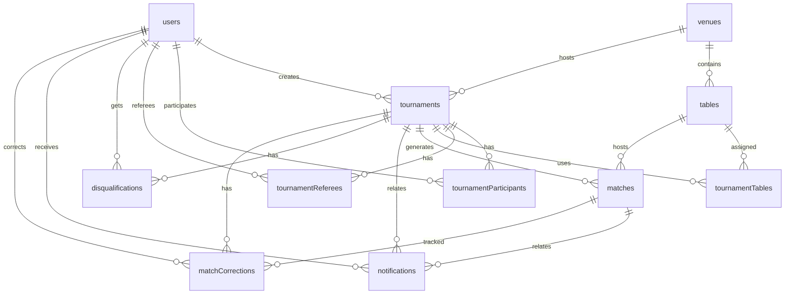

# Техническая документация Cue Bot

## Содержание

1. [Обзор системы](#обзор-системы)
2. [Архитектура проекта](#архитектура-проекта)
3. [Модель данных](#модель-данных)
4. [Схемы пользовательских путей](#схемы-пользовательских-путей)
5. [API и команды бота](#api-и-команды-бота)
6. [Бизнес-логика](#бизнес-логика)
7. [Админ-панель](#админ-панель)
8. [Особенности реализации](#особенности-реализации)

---

## Обзор системы

**Cue Bot** — система для проведения турниров по бильярду, состоящая из Telegram-бота, HTTP API и административной SPA-панели. Проект покрывает полный жизненный цикл турнира: создание черновика, выбор площадки и столов, регистрацию участников, генерацию сетки, проведение матчей, фиксацию результатов и уведомления через Telegram.

### Технологический стек

- **Runtime**: Node.js + TypeScript
- **Telegram Bot Framework**: Grammy
- **HTTP API**: Hono
- **Валидация API**: Zod + `@hono/zod-validator`
- **База данных**: PostgreSQL
- **ORM**: Drizzle ORM
- **Admin SPA**: React + Vite + TanStack Query
- **Аутентификация админки**: JWT + одноразовые коды / токены
- **Работа с датой и временем**: Luxon
- **Dev tooling**: Nodemon, TSX, Prettier, ESLint 9

### Основные возможности

- Создание турниров через Telegram-бота и через admin-панель
- Обязательная привязка турнира к площадке (`venue`)
- Выбор столов только в рамках выбранной площадки
- Регистрация и отмена регистрации участников
- Автоматическая генерация сетки для `single_elimination`, `double_elimination` и `round_robin`
- Проведение матчей с двухфазным подтверждением результата
- Технические результаты для администраторов и судей
- Назначение судей на конкретные турниры
- Telegram-уведомления по ключевым событиям турнира
- Административный веб-интерфейс с JWT-защитой маршрутов

---

## Архитектура проекта

### Структура директорий

```text
cue-bot/
├── src/
│   ├── admin/
│   │   └── server/
│   │       ├── routes/                  # Hono-маршруты admin API
│   │       ├── apiTypes.ts              # общие API-типы сервера
│   │       ├── auth.ts                  # логика входа в admin-панель
│   │       ├── formats.ts               # форматы турнира и их локализация
│   │       ├── index.ts                 # сборка Hono-приложения admin API
│   │       └── middleware.ts            # JWT-проверка и загрузка adminUser
│   ├── bot/
│   │   ├── @types/                      # типы для bot/UI/API read-моделей
│   │   ├── handlers/                    # команды и callback-обработчики Grammy
│   │   ├── middleware/                  # auth + wizardGuard middleware для бота
│   │   ├── ui/                          # форматирование сообщений и клавиатуры
│   │   ├── wizards/
│   │   │   ├── tournamentCreation/
│   │   │   │   ├── tournamentCreation.const.ts
│   │   │   │   ├── tournamentCreation.d.ts
│   │   │   │   ├── tournamentCreation.flow.ts
│   │   │   │   ├── tournamentCreation.keyboards.ts
│   │   │   │   ├── tournamentCreation.module.ts
│   │   │   │   ├── tournamentCreation.renderer.ts
│   │   │   │   └── tournamentCreation.stateStore.ts
│   │   │   └── wizardRegistry.ts        # реестр и диспетчер wizard-ов
│   │   ├── commands.ts
│   │   ├── instance.ts
│   │   ├── permissions.ts
│   │   └── types.ts                     # BotContext / SessionData
│   ├── db/
│   │   ├── schema/                      # схемы таблиц Drizzle по файлам
│   │   ├── db.ts
│   │   ├── schema.ts                    # реэкспорт схем и типов
│   │   └── schemaHelpers.ts             # общие колонки и обёртка схемы
│   ├── services/
│   │   ├── bracketGenerator.ts
│   │   ├── matchService.ts
│   │   ├── notificationService.ts
│   │   ├── participantService.ts
│   │   ├── randomBracketAdvancement.ts  # placeholder продвижения по сетке
│   │   ├── tableService.ts
│   │   ├── timeoutService.ts            # placeholder (авто-таймауты вне scope)
│   │   ├── tournamentService.ts
│   │   ├── tournamentStartService.ts
│   │   ├── userService.ts
│   │   ├── userStatsService.ts
│   │   └── venueService.ts
│   ├── utils/
│   │   ├── constants.ts
│   │   ├── dateTimeHelper.ts
│   │   └── messageHelpers.ts
│   └── index.ts                         # запуск бота и HTTP-сервера
├── admin/
│   ├── src/
│   │   ├── components/
│   │   ├── lib/
│   │   └── pages/
│   ├── package.json
│   └── vite.config.ts
├── scripts/                            # сиды и вспомогательные скрипты
├── TECHNICAL_DOCUMENTATION.md
├── CHANGELOG.md
├── BUSINESS_REQUIREMENTS.md
├── README.md
├── drizzle.config.ts
├── eslint.config.js
├── nodemon.json
├── package.json
└── tsconfig.json
```

### Слои приложения

1. **Telegram Bot / Admin SPA**
   Бот работает через Grammy, admin-панель через React SPA.

2. **Transport Layer**
   Входящие Telegram-сообщения и callback query обрабатываются в `src/bot/handlers/*`. HTTP-запросы админки обслуживаются через Hono-маршруты в `src/admin/server/routes/*`.

3. **Middleware / Guards**
   Бот использует `authMiddleware` и `wizardGuardMiddleware`, admin API использует `requireAdmin`. Проверка ролей вынесена в `permissions.ts`.

4. **Service Layer**
   Основная бизнес-логика сосредоточена в `src/services/*`.

5. **Persistence Layer**
   PostgreSQL + Drizzle ORM. Схема разбита по сущностям, все идентификаторы типизированы как `UUID`.

### Запуск и сборка

| Команда               | Назначение                                      |
| --------------------- | ----------------------------------------------- |
| `npm run dev`         | запуск Telegram-бота и HTTP API через `nodemon` |
| `npm run dev:admin`   | запуск Vite dev server для admin SPA            |
| `npm run dev:all`     | поднять БД и запустить api + web + drizzle studio |
| `npm run build`       | сборка серверной части (`tsc && tsc-alias`)     |
| `npm run start`       | запуск собранного бота из `build/`              |
| `npm run build:admin` | сборка admin SPA                                |
| `npm run db:up` / `db:down` | запуск / остановка Docker-контейнера PostgreSQL |
| `npm run lint`        | запуск ESLint                                   |
| `npm run lint:fix`    | автопочинка ESLint-замечаний                    |
| `npm run format`      | форматирование через Prettier                   |
| `npm run db:generate` | генерация артефактов Drizzle                    |
| `npm run db:migrate`  | выполнение миграций                             |
| `npm run db:studio`   | запуск Drizzle Studio                           |
| `npm run seed:de`     | сид для double elimination сценария             |

### Переменные окружения

| Переменная     | Назначение                                |
| -------------- | ----------------------------------------- |
| `BOT_TOKEN`    | токен Telegram-бота                       |
| `DATABASE_URL` | строка подключения к PostgreSQL           |
| `JWT_SECRET`   | секрет для подписи JWT админки            |
| `ADMIN_PORT`   | порт HTTP API / встроенного admin-сервера |
| `NODE_ENV`     | `development` / `production`              |

### TypeScript-конфигурация

- Корневой `tsconfig.json` использует `baseUrl: "."` и alias `@/* -> src/*`
- Серверный код импортирует внутренние модули через `@/...`
- Admin SPA собирается отдельно и использует собственный `admin/tsconfig.json`
- Схемы Drizzle экспортируют не только таблицы, но и прикладные типы (`ITournamentFormat`, `ITournamentWinScore`, `NotificationType` и т.д.)

---

## Модель данных

### Диаграмма базы данных



### Описание таблиц

#### users

Пользователи Telegram-бота и admin-панели.

- `id`: UUID primary key
- `telegram_id`: уникальный Telegram ID
- `username`: username Telegram
- `role`: `user` | `admin`
- пользователь может быть создателем турниров, участником, судьей и получателем уведомлений

#### venues

Площадки проведения турниров.

- `id`: UUID primary key
- `name`: отображаемое название площадки
- `address`: адрес площадки
- `image`: опциональная ссылка на изображение
- `tablesCount`: вычисляемое поле read-модели API, не хранится в таблице напрямую

#### tables

Физические бильярдные столы.

- `id`: UUID primary key
- `name`: имя стола
- `venueId`: обязательная ссылка на `venues.id`
- стол не может существовать вне площадки

#### tournaments

Турниры.

- `id`: UUID primary key
- `venueId`: обязательная ссылка на площадку проведения
- `discipline`: сейчас поддерживается `snooker`
- `format`: `single_elimination` | `double_elimination` | `round_robin`
- `status`: `draft` -> `registration_open` -> `registration_closed` -> `in_progress` -> `completed` / `cancelled`
- `maxParticipants`: одно из значений `[8, 16, 32, 64, 128]`
- `winScore`: одно из значений `[2, 3, 4, 5]`
- `createdBy`: ссылка на администратора, создавшего турнир
- read-модель турнира дополняется полем `venueName`

#### tournamentParticipants

Связь пользователя с турниром.

- составной ключ: `tournamentId + userId`
- `status`: `pending` | `confirmed` | `cancelled`
- `seed`: позиция в сетке, назначается перед стартом турнира
- хранит историю регистрации до генерации матчей

#### tournamentReferees

Назначенные судьи турнира.

- составной ключ: `tournamentId + userId`
- используется для выдачи расширенных прав на матчи конкретного турнира

#### tournamentTables

Связь турнира со столами.

- составной ключ: `tournamentId + tableId`
- `position`: порядок столов внутри турнира
- перед записью проверяется, что все столы принадлежат выбранной площадке турнира

#### matches

Матчи турнира.

- `round` / `position`: координаты матча в сетке
- `player1Id` / `player2Id`: участники матча (nullable до заполнения сетки)
- `player1Score` / `player2Score`: счет матча
- `player1IsWalkover` / `player2IsWalkover`: признак прохода без игры (bye)
- `status`: `scheduled` | `in_progress` | `pending_confirmation` | `completed` | `cancelled`
- `bracketType`: `winners` | `losers` | `grand_final`
- `nextMatchId` / `nextMatchPosition`: ссылка на следующий матч и слот (`player1` / `player2`)
- `losersNextMatchPosition`: позиция в нижней сетке для double elimination
- `tableId`: стол, на котором идет матч
- `reportedBy` / `confirmedBy`: участники двухфазного подтверждения результата
- `isTechnicalResult`: признак технического исхода
- `technicalReason`: причина технического результата
- `isCorrected` / `correctionReason`: признак и причина ручной корректировки результата

#### matchCorrections

История ручных корректировок результатов матчей.

- `matchId`: исправленный матч
- `tournamentId`: турнир матча
- `correctedBy`: кто внес исправление
- `reason`: причина корректировки
- `previousPlayer1Score` / `previousPlayer2Score` / `previousWinnerId`: значения до исправления
- `newPlayer1Score` / `newPlayer2Score` / `newWinnerId`: значения после исправления
- `affectedMatchIds`: массив матчей ниже по сетке, сброшенных как следствие смены победителя

#### notifications

Уведомления, сохраняемые перед отправкой через Telegram.

- `type`: `registration_confirmed`, `registration_rejected`, `bracket_formed`, `match_reminder`, `result_confirmation_request`, `result_confirmed`, `tournament_results`, `new_registration`, `participant_limit_reached`, `result_dispute`, `match_result_pending`, `disqualification`
- `isSent`: было ли сообщение реально отправлено в Telegram
- `isRead`: было ли уведомление отмечено как прочитанное
- уведомление может ссылаться на турнир и/или матч

#### loginCodes

Одноразовые числовые коды для входа в admin-панель.

- ограниченный TTL
- ограниченное число попыток ввода

#### loginTokens

Одноразовые URL-токены для входа в admin-панель без ручного ввода кода.

#### disqualifications

Факты дисквалификации участников.

- `tournamentId`: турнир, в рамках которого произошла дисквалификация
- `userId`: дисквалифицированный пользователь
- `disqualifiedBy`: кто установил дисквалификацию
- `reason`: причина дисквалификации

---

## Схемы пользовательских путей

### 1. Первый запуск бота

```text
/start
  -> authMiddleware
    -> поиск пользователя по telegram_id
    -> создание пользователя с ролью user, если записи нет
    -> обновление username
    -> добавление ctx.dbUser в контекст
```

### 2. Создание турнира в Telegram-боте

Команда `/create_tournament` запускает модульный wizard из `src/bot/wizards/*`.

Шаги мастера:

1. Ввод названия турнира
2. Ввод даты старта
3. Выбор площадки
4. Выбор дисциплины
5. Выбор формата
6. Выбор максимума участников
7. Выбор `winScore`
8. Опциональный выбор столов площадки

Особенности:

- состояние wizard хранится в `TournamentCreationStateStore`
- выбор площадки обязателен
- если у площадки нет столов, шаг выбора столов завершается через `tables_skip`
- создание завершается вызовом `createTournamentDraft()` и сохранением турнира в статусе `draft`
- `/cancel` очищает активную сессию создания

### 3. Создание турнира в admin SPA

Создание происходит через `CreateTournamentModal`.

Порядок работы формы:

1. Загрузка площадок (`venuesApi.list()`)
2. Обязательный выбор `venueId`
3. Фильтрация списка столов по выбранной площадке
4. Отправка `POST /api/tournaments`
5. Сервер вызывает `createTournamentDraft()` и возвращает read-модель турнира

Если площадок нет, UI блокирует создание турнира и предлагает перейти к маршруту `/venues`.

### 4. Жизненный цикл турнира

```text
draft
  -> registration_open
    -> registration_closed
      -> in_progress
        -> completed

Любой турнир, который еще не ушел в проведение, может быть переведен в cancelled.
Удаление разрешено только для draft/cancelled.
```

При старте турнира:

1. Проверяется минимальное число участников
2. Участникам назначаются `seed`
3. `bracketGenerator` строит сетку
4. `matchService.createMatches()` создает матчи и связи `nextMatchId`
5. Статус турнира меняется на `in_progress`
6. Участники получают уведомления

### 5. Регистрация участника

```text
/tournaments -> карточка турнира
  -> reg:join:{tournamentId}
    -> проверка статуса турнира
    -> проверка лимита участников
    -> проверка, что пользователь не зарегистрирован повторно
    -> запись в tournamentParticipants
```

Отмена идет через `reg:cancel:{tournamentId}`.

### 6. Проведение матча

```text
/my_matches -> карточка матча
  -> match:start:{id}
    -> status = in_progress
  -> match:report:{id}
    -> выбор счета (match:score:{id}:{p1}:{p2})
    -> status = pending_confirmation
  -> match:confirm:{id}
    -> status = completed
    -> advanceWinner()
  -> match:dispute:{id}
    -> статус возвращается в in_progress
```

### 7. Технический результат

Администратор или назначенный судья может установить технический результат:

- `match:tech:{id}` — открыть меню выбора победителя
- `match:tech_win:{id}:{playerIndex}:{reason}` — установить победителя (`playerIndex` = `1` | `2`)
- победителю засчитывается счет `winScore:0`
- матч завершается без двухфазного подтверждения, далее вызывается `advanceWinner()`

### 8. Завершение турнира

Если у завершенного матча нет `nextMatchId`, `matchService.advanceWinner()` вызывает `completeTournament()`.

Результат:

- турнир получает статус `completed`
- освобождается стол матча, если он был назначен
- участникам рассылаются итоговые уведомления

### 9. Управление ролями

- `/set_admin @username` — назначить администратора
- `/remove_admin @username` — снять роль администратора
- `/assign_referee {tournament_id} @username` — назначить судью турнира
- `/remove_referee {tournament_id} @username` — снять судью турнира

---

## API и команды бота

### Команды для пользователей

| Команда                   | Назначение                       |
| ------------------------- | -------------------------------- |
| `/start`                  | регистрация и приветствие        |
| `/help`                   | как пользоваться ботом           |
| `/tournaments`            | список турниров                  |
| `/my_tournaments`         | турниры пользователя             |
| `/my_matches`             | активные матчи пользователя      |
| `/me`                     | профиль и статистика             |
| `/tournament [id]`        | карточка турнира                 |

### Команды для судей

| Команда            | Назначение                             |
| ------------------ | -------------------------------------- |
| `/referee_matches` | матчи турниров, где пользователь судья |

> Управление участниками (подтверждение / отклонение заявок) доступно админам не отдельной командой, а инлайн-кнопкой из карточки турнира (`adm:pending_list`).

### Команды для администраторов

| Команда                   | Назначение                                       |
| ------------------------- | ------------------------------------------------ |
| `/create_tournament`      | запуск мастера создания турнира                  |
| `/delete_tournament [id]` | удаление турнира в статусе `draft` / `cancelled` |
| `/set_admin`              | выдать роль администратора                       |
| `/remove_admin`           | снять роль администратора                        |
| `/assign_referee`         | назначить судью турнира                          |
| `/remove_referee`         | снять судью турнира                              |
| `/dashboard`              | получить одноразовую ссылку на admin-панель      |
| `/cancel`                 | отменить текущий wizard создания                 |

### Callback Query паттерны

#### Регистрация

- `reg:join:{tournamentId}`
- `reg:cancel:{tournamentId}`
- `reg:full:{tournamentId}`

#### Управление турниром

- `tournament_info:{id}`
- `tournament_open_reg:{id}`
- `tournament_close_reg:{id}`
- `tournament_start:{id}`
- `tournament_start_confirm:{id}`
- `tournament_delete_confirm:{id}`
- `tournament_delete:{id}`
- `tournament_delete_cancel`

#### Управление участниками (админ)

- `adm:pending_list:{tournamentId}` — открыть список заявок
- `adm:c:{key}` — подтвердить заявку
- `adm:r:{key}` — отклонить заявку
- `adm:rm:{key}` — снять подтверждённого участника

#### Wizard создания турнира

- `tc:venue:{venueId}`
- `tc:discipline:{value}`
- `tc:format:{value}`
- `tc:participants:{n}`
- `tc:winscore:{n}`
- `tc:tables_toggle:{tableId}`
- `tc:tables_all`
- `tc:tables_done`
- `tc:tables_skip`

#### Матчи

- `match:view:{id}`
- `match:start:{id}`
- `match:report:{id}`
- `match:score:{id}:{p1}:{p2}`
- `match:confirm:{id}`
- `match:dispute:{id}`
- `match:waiting:{id}` — индикатор ожидания подтверждения соперника
- `match:tech:{id}` — меню технического результата
- `match:tech_win:{id}:{playerIndex}:{reason}` (`playerIndex` = `1` | `2`)

#### Сетка

- `bracket:view:{tournamentId}`

#### Главное меню

- `menu:tournaments` — открыть список турниров (кнопка онбординга)
- прочие пункты меню (`🎱 Мои матчи`, `📋 Турниры`, `👤 Профиль`) — reply-keyboard кнопки, обрабатываемые через `hears`, а не callback

### Admin API (Hono)

Все `/api/*` маршруты, кроме `/api/auth/*` и `/api/health`, защищены `requireAdmin`.

#### Служебные маршруты

- `GET /api/health`
- `/api/auth/*` — логин, подтверждение кода, выход, проверка сессии

#### Турниры

- `GET /api/tournaments`
- `GET /api/tournaments/:id`
- `POST /api/tournaments`
- `PATCH /api/tournaments/:id/status`
- `POST /api/tournaments/:id/start`
- `DELETE /api/tournaments/:id`
- `GET /api/tournaments/:id/tables`
- `GET /api/tournaments/:id/participants`
- `POST /api/tournaments/:id/participants`
- `PATCH /api/tournaments/:id/participants/:userId` (confirm / reject)
- `DELETE /api/tournaments/:id/participants/:userId`
- `PATCH /api/tournaments/:id/participants/:userId/seed`
- `POST /api/tournaments/:id/participants/seeds/randomize`
- `GET /api/tournaments/:id/stats`

#### Матчи

- `GET /api/matches/tournament/:tournamentId`
- `GET /api/matches/tournament/:tournamentId/stats`
- `GET /api/matches/:id`
- `POST /api/matches/:id/start`
- `POST /api/matches/:id/report`
- `POST /api/matches/:id/confirm`
- `POST /api/matches/:id/dispute`
- `POST /api/matches/:id/technical`
- `POST /api/matches/:id/correct/preview` (dry-run корректировки)
- `POST /api/matches/:id/correct` (корректировка результата с откатом сетки)
- `POST /api/matches/:id/advance` (повторное продвижение победителя)
- `PUT /api/matches/:id/table` (назначить / сменить / снять стол)

#### Пользователи

- `GET /api/users`
- `GET /api/users/:id`
- `PATCH /api/users/:id/role`
- `POST /api/users/:id/referee`
- `DELETE /api/users/:id/referee/:tournamentId`

#### Площадки и столы

- `GET /api/venues`
- `POST /api/venues`
- `PATCH /api/venues/:id`
- `DELETE /api/venues/:id`
- `GET /api/tables`
- `POST /api/tables`
- `DELETE /api/tables/:id`

---

## Бизнес-логика

### tournamentService

Ключевой сервис работы с турнирами.

- `createTournamentDraft(input)`
  - проверяет существование площадки
  - дедуплицирует `tableIds`
  - валидирует соответствие столов площадке через `validateTableIdsForVenue()`
  - в транзакции создает турнир и записи в `tournamentTables`
  - возвращает read-модель турнира с `venueName`
- `getTournament(id)` и `getTournaments()` читают турниры через `LEFT JOIN venues`
- `canStartTournament(id)` проверяет статус и достаточное количество участников
- `assignRandomSeeds(id)` расставляет сиды перед генерацией сетки
- `closeRegistrationWithCount(id)` закрывает регистрацию и записывает число подтвержденных участников
- `completeTournament(id)` переводит турнир в `completed`

### tableService

Сервис работы со столами и их привязками.

- `getTables()` — получить все столы
- `getTablesByVenue(venueId)` — получить столы конкретной площадки
- `getTournamentTables(tournamentId)` — получить столы турнира
- `setTournamentTables(tournamentId, tableIds)` — переустановить привязки турнира к столам
- `validateTableIdsForVenue(tableIds, venueId)` — защита от выбора столов чужой площадки

### venueService

Сервис работы с площадками.

- `getVenues()` и `getVenue(id)` возвращают площадки вместе с `tablesCount`
- `createVenue`, `updateVenue`, `deleteVenue` используются admin API
- тип `ApiVenue` теперь живет в bot/shared type-слое, а не в admin-only типах

### participantService

Сервис работы с участниками турнира.

- `confirmParticipant(tournamentId, userId)` переводит заявку в `confirmed`
- `rejectParticipant(tournamentId, userId)` отклоняет заявку
- `deleteParticipant(tournamentId, userId)` удаляет участника
- `setParticipantSeed()` и `randomizeSeeds()` управляют посевом перед стартом

### userService

Сервис работы с пользователями и ролями.

- поиск пользователя по `telegram_id` / `username`
- выдача и снятие роли `admin`
- назначение и снятие судейства (`tournamentReferees`)

### userStatsService

Статистика игрока для команды `/me` и профиля.

- `getUserMatchStats(userId)` — сыгранные матчи, победы, поражения, win-rate
- `getUserCompletedTournaments(userId, limit)` — история последних турниров с признаком победителя

### participantService

Сервис работы с участниками турнира.

- `confirmParticipant(tournamentId, userId)` переводит заявку в `confirmed`
- `rejectParticipant(tournamentId, userId)` отклоняет заявку
- `deleteParticipant(tournamentId, userId)` удаляет участника
- `setParticipantSeed()` и `randomizeSeeds()` управляют посевом перед стартом

### userService

Сервис работы с пользователями и ролями.

- поиск пользователя по `telegram_id` / `username`
- выдача и снятие роли `admin`
- назначение и снятие судейства (`tournamentReferees`)

### userStatsService

Статистика игрока для команды `/me` и профиля.

- `getUserMatchStats(userId)` — сыгранные матчи, победы, поражения, win-rate
- `getUserCompletedTournaments(userId, limit)` — история последних турниров с признаком победителя

### matchService

Сервис матча и прохода по сетке.

- `createMatches(tournamentId, bracket)` создает матчи и вторым проходом связывает `nextMatchId`
- `startMatch(id)` переводит матч в `in_progress`
- `reportResult(id, reporterId, p1, p2)` переводит матч в `pending_confirmation`
- `confirmResult(id, confirmerId)` завершает матч и вызывает `advanceWinner()`
- `disputeResult(id, userId)` сбрасывает промежуточный результат
- `setTechnicalResult(id, winnerId, reason, setById)` выставляет техническую победу
- `onTableFreed()`, `assignTableAndStart()` и `setMatchTable()` управляют использованием столов
- `previewCorrection(id, p1, p2)` — dry-run: валидирует корректировку и считает число затронутых матчей
- `correctMatchResult(id, p1, p2, reason, correctedBy)` исправляет результат завершенного матча; при смене победителя откатывает зависимые матчи в `scheduled` и пере-продвигает нового победителя, фиксируя запись в `matchCorrections`
- `resyncAdvancement(id)` — идемпотентное восстановление: повторно продвигает победителя, если откат после корректировки не прошел

### tournamentStartService

Оркестратор старта турнира.

Порядок работы `startTournamentFull()`:

1. Получение турнира и участников
2. Назначение `seed`
3. Построение сетки
4. Создание матчей
5. Перевод турнира в `in_progress`
6. Отправка стартовых уведомлений

### bracketGenerator

Генератор сетки.

- поддерживает `single_elimination`, `double_elimination`, `round_robin`
- использует типизированные `UUID` для слотов игроков (`null` — пустой слот)
- bye-слоты не маскируются под пользователя, а помечаются флагами `player1IsWalkover` / `player2IsWalkover`; матчи с автопроходом сразу создаются в статусе `completed`
- предоставляет `getBracketStats()`, `getRoundName()`, `calculateRounds()` и `getNextPowerOfTwo()` для bot/admin UI

### notificationService

Сервис записи и отправки уведомлений.

- `createNotification()` создает запись и возвращает `UUID`
- `sendNotification()` отправляет сообщение через Telegram API и помечает уведомление как отправленное
- `createAndSendNotification()` объединяет запись и отправку
- отдельные методы покрывают события матча, турнира и дисквалификации

### DateTimeHelper

`src/utils/dateTimeHelper.ts` заменяет старый `dateHelpers.ts`.

Поддерживаемые сценарии:

- Unix timestamp в секундах и миллисекундах
- ISO, RFC 2822, HTTP, SQL форматы Luxon
- пользовательские строки вида `dd.MM.yyyy`, `dd.MM.yyyy HH:mm`, `yyyy-MM-dd`, `dd/MM/yyyy` и смежные варианты
- все даты нормализуются к UTC
- форматирование по умолчанию: `dd.LL.yyyy HH:mm`

### Middleware и Guards

#### authMiddleware

- ищет пользователя по `telegram_id`
- создает нового пользователя с ролью `user`, если записи нет
- обновляет `username`
- добавляет `ctx.dbUser` в контекст Grammy

#### requireAdmin

- читает `admin_token` из cookie
- валидирует JWT
- на каждом запросе заново проверяет роль пользователя в БД
- сохраняет `adminUser` в контексте Hono

#### adminOnly / permissions

- бот проверяет роль администратора через `permissions.ts`
- для части действий дополнительно учитываются турнирные судьи

---

## Админ-панель

### Аутентификация

Вход в панель двухступенчатый:

1. Администратор вводит Telegram username
2. Сервер ищет пользователя и проверяет роль `admin`
3. В Telegram отправляется код входа или одноразовая ссылка
4. После подтверждения выдается JWT в cookie `admin_token`

### Основные страницы SPA

Актуальные маршруты приложения:

- `/tournaments` — список турниров и создание черновиков
- `/tournaments/:id` — карточка турнира, участники, матчи, столы, статистика
- `/matches/:id` — карточка матча и ручное управление результатом
- `/venues` — управление площадками
- `/users` — управление ролями пользователей и судейством
- `/` и неизвестные маршруты редиректят на `/tournaments`

### Особенности UI создания турнира

- форма требует обязательный `venueId`
- список столов появляется только после выбора площадки
- при смене площадки выбранные столы очищаются
- если у площадки нет столов, турнир все равно можно создать
- если площадок нет вообще, форма не дает отправить запрос

---

## Особенности реализации

- **Модульный wizard**: логика создания турнира вынесена в каталог `wizards/tournamentCreation/` (`flow`, `renderer`, `keyboards`, `stateStore`, `module`, `const`), а активные wizard-сессии диспетчеризуются через `wizardRegistry.ts`
- **Корректировка результатов**: завершенный матч можно пересчитать (`correctMatchResult`); при смене победителя зависимые матчи откатываются, а история пишется в `matchCorrections`
- **In-memory state**: сессии создания турнира пока хранятся в `Map`; при перезапуске процесса незавершенные wizard-сессии теряются
- **Type-safe UUID**: UUID типизированы на уровне схем Drizzle, сервисов и Hono-маршрутов
- **Venue-first модель турнира**: турнир теперь не может существовать без площадки, а выбор столов ограничен ее контекстом
- **Read model турнира**: bot/admin UI работают не только с raw-записью турнира, но и с обогащенной моделью, включающей `venueName`
- **UTC нормализация дат**: единая работа со временем реализована через Luxon и `DateTimeHelperInstance`
- **Path alias**: серверный код использует alias `@/*`, что уменьшает количество относительных импортов
- **JWT re-check**: admin middleware не доверяет только payload токена и перепроверяет роль в БД на каждом запросе
